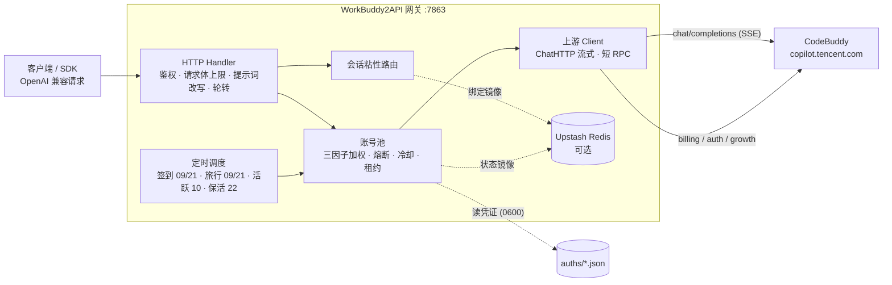

<p align="center">
  
</p>

<h1 align="center">WorkBuddy2API Panel <sub><code>1.12.0-zhima</code></sub></h1>

<p align="center">
  <b>把腾讯 CodeBuddy 账号变成 OpenAI 兼容 API 的多账号网关 · 附 Web 管理面板</b><br>
  <b>多协议入口</b>（Anthropic Messages · OpenAI Responses · Gemini generateContent）· <b>调用记录</b>（分页 / 字段过滤 / 失败详情）· <b>API 密钥管理</b> · 模型级限流精确冷却 · 账号池轮转 · 熔断与冷却 · 会话粘性 · 定时签到 / 活跃 / 旅行 / 保活 / 成长任务队列 · <b>成长任务一键完成（17/18）</b> · 流式 / 非流式
</p>

<p align="center">
  
  
  
  
  
  
</p>

---

> **维护状态**：本项目自 `v1.12.0-zhima` 起**独立维护**（`1.11.x` 为上游基线时代），版本号随功能递增，`-zhima` 为项目标识后缀。
> 基线来自 [linguo2625469/workbuddy2api-panel](https://github.com/linguo2625469/workbuddy2api-panel)（其本身是 [Sliverkiss/workbuddy2api](https://github.com/Sliverkiss/workbuddy2api) 的增强分支）。
> 本项目在基线之上的二次开发见 **[本项目的二开特性](#-本项目的二开特性)**——多协议入口、调用记录、API 密钥管理、模型级限流精确冷却等，每一项都可在 `git log` 中逐项核对。

## 目录

| 上手 | 二开与功能 | 参考 | 边界 |
|---|---|---|---|
| [项目简介](#项目简介) | [**本项目的二开特性**](#-本项目的二开特性) | [配置说明](#配置说明) | [安全与合规](#安全与合规) |
| [快速开始](#快速开始) | [成长任务一键完成（17/18）](#-成长任务一键完成1718) | [API 端点](#-api-端点) | [常见问题](#常见问题) |
| [核心能力](#核心能力) | [核心行为语义](#核心行为语义) | [请求级日志](#请求级日志) | [免责声明](#免责声明) |
| [架构总览](#架构总览) | [Web 管理面板](#-web-管理面板) | [部署运维](#部署运维) | [License](#license) |
| [仓库结构](#仓库结构) | [与上游的差异](#-与上游的差异继承自增强分支) | — | — |

**深度文档**（从 README 拆出，全文保留）：[成长任务与活动体系](docs/tasks.md) · [核心行为语义与运行时细节](docs/behavior.md) · [基线沿革与关键断言对照](docs/upstream.md) · [常见问题（完整）](docs/faq.md)

## 项目简介

WorkBuddy2API 是一个自托管的 **OpenAI 兼容反向代理网关**，将腾讯 CodeBuddy（`copilot.tencent.com`）账号包装为统一的 `/v1/chat/completions` 服务。

- 官方不提供 OpenAI 形态的开放 API，本项目通过 **OAuth 设备授权**（面板「添加账号」或 `login.sh`）获取账号凭证，在网关侧做 token 自动刷新、账号池调度与流量治理；
- 面向 **个人多账号** 场景：多账号共享、单号故障自动换号、冷却 / 熔断防止雪崩、会话粘性保证多轮上下文不跳号；
- 对客户端只暴露 OpenAI 兼容接口，现有 SDK / 前端 / 工具 **零改造接入**；并额外提供 **Anthropic Messages / OpenAI Responses / Gemini generateContent** 三个入站协议入口（详见[本项目的二开特性](#-本项目的二开特性)）。

> ⚠️ 合规须知：本项目是**非官方**网关，使用 CodeBuddy 账号作为上游，**仅限本人授权账号、本机 / 私有环境测试**。详细边界见[安全与合规](#安全与合规)。

## 快速开始

### 环境要求

- **Docker + Docker Compose**（服务端部署方式，镜像内已含低权限用户与全部工具脚本）——或
- **Windows / macOS / Linux 直接跑单文件二进制**（无需 Docker，见下方「Windows 单文件运行」）
- 一个或多个已注册的 CodeBuddy 账号，用于 OAuth 登录
- 宿主机 Go ≥ 1.22（仅从源码构建时需要）

### 方式〇：GHCR 镜像（免克隆免构建）

CI 会自动构建多架构镜像（`amd64` / `arm64`）并发布到 GHCR，`git clone` 之外的部署路径：

```bash
# 1. 准备配置与数据目录
mkdir -p auths data && cp config.example.json config.json
#    建议编辑 config.json 设置 api_key（或留空由程序自动生成随机密钥）

# 2. 拉取并运行（-p 默认只绑本机回环；需远程访问改为 -p 7863:7863 并务必设置 api_key）
docker run -d --name workbuddy2api \
  -p 127.0.0.1:7863:7863 -e TZ=Asia/Shanghai \
  -v ./auths:/app/auths -v ./data:/app/data -v ./config.json:/app/config.json \
  ghcr.io/moonkey0510/workbuddy_api:latest

# 3. 健康检查（无可用账号时返回 503）
curl -s http://localhost:7863/healthz
```

> **首次发布后须将包设为公开**：GitHub 仓库页 → Packages → `workbuddy_api` →
> Package settings → Change visibility → Public，否则拉取需要 `docker login ghcr.io`。
>
> 镜像 tag 规则：`main` 分支推送 `latest` / `main` / `sha-xxxxxx`；打 `v*` tag 额外发布
> `1.2.3` / `1.2` / `1` 语义化版本；PR 仅构建验证、不推送。

### 方式一：Docker Compose（推荐服务器部署）

```bash
# 1. 克隆
git clone https://github.com/MOONKEY0510/workbuddy_api.git
cd workbuddy_api

# 2. 准备配置（compose 挂载此文件，缺失会导致容器启动失败）
cp config.example.json config.json
#    建议编辑 config.json 设置 api_key（或留空由程序自动生成随机密钥）

# 3. 启动（首次会构建镜像，约 1-2 分钟）
docker compose up -d --build

# 4. 健康检查（无可用账号时返回 503）
curl -s http://localhost:7863/healthz
# {"healthy":0,"total":0,"service":"workbuddy2api"}
```

启动后打开 **`http://localhost:7863/panel/`**，用面板「添加账号」完成登录（见下节）。

> compose 默认只绑宿主机回环 `127.0.0.1:7863`（安全默认）：需从局域网 / 其他机器访问时，
> 把 `docker-compose.yml` 的 ports 改为 `"7863:7863"`，并**务必**设置 `api_key`、建议前置 HTTPS 反代。

常用运维命令：

```bash
docker compose logs -f          # 跟踪日志
docker compose restart          # 重启
docker compose down             # 停止并移除容器（数据在 ./auths 与 ./data，不受影响）
```

### 方式二：Windows 单文件运行（无需 Docker）

```powershell
# 1) 下载 Release 中的 wb2api.exe，或从源码构建
go build -trimpath -ldflags="-s -w" -o wb2api.exe ./cmd/server

# 2) 直接运行：首次启动自动生成 config.json（含随机 api_key，记录在该文件里）
.\wb2api.exe -config config.json

# 3) 浏览器打开面板添加账号
#    http://127.0.0.1:7863/panel/
```

exe 为**单文件自包含**（前端资源已 embed 进二进制），拷到任意 Windows 机器即可运行，只需保证 `auths/`（凭证）与 `data/`（状态）目录可写。

### 方式三：源码运行（开发调试）

```bash
go build ./...
go vet ./...
go test ./...                      # 完整测试套件
go run ./cmd/server -config config.json
```

构建全部二进制：

```bash
CGO_ENABLED=0 go build -trimpath -ldflags="-s -w" -o wb2api ./cmd/server
CGO_ENABLED=0 go build -trimpath -ldflags="-s -w" -o signin_bin ./cmd/signin
CGO_ENABLED=0 go build -trimpath -ldflags="-s -w" -o login ./cmd/login
CGO_ENABLED=0 go build -trimpath -ldflags="-s -w" -o credit ./cmd/credit
```

### 添加账号（登录）

**方式 A：Web 面板（推荐，各平台通用，免命令行）**

打开 `http://127.0.0.1:7863/panel/`，点右上角「**添加账号**」（弹窗内可选 CN / Global 版本，也支持导入 JSON 批量添加）：面板展示授权链接 → 浏览器完成登录 → 自动检测并落盘凭证 → **热加载进池（无需重启）**，顺带完成首次签到。

**方式 B：命令行脚本（仅 Linux / macOS，依赖 bash + python3）**

```bash
./login.sh
# 按提示在浏览器打开授权链接 → 回到终端确认 → 凭证落盘 auths/workbuddy-<uid>.json
```

`login.sh` 内置授权 URL 获取 + 浏览器登录 + token 轮询 + 首次签到 + 凭证落盘 + 容器重启，全程无 PKCE（state 由服务端签发）。账号池在容器启动时用 `auths/` 目录自动对齐，新增凭证文件即自动发现。

> Windows 用户请用方式 A（或 WSL）；`login.sh` 需要 python3。

### 验证

```bash
# 模型列表
curl -s http://localhost:7863/v1/models -H "Authorization: Bearer your-api-key"

# 账号状态（汇总 + 每账号详情，disabled 账号透出 disabled_reason）
curl -s http://localhost:7863/status -H "Authorization: Bearer your-api-key"

# 流式聊天
curl -sN http://localhost:7863/v1/chat/completions \
  -H "Authorization: Bearer your-api-key" \
  -H "Content-Type: application/json" \
  -d '{"model":"deepseek-v4-flash","messages":[{"role":"user","content":"hi"}],"stream":true}'

# 非流式聊天（本地聚合）
curl -s http://localhost:7863/v1/chat/completions \
  -H "Authorization: Bearer your-api-key" \
  -H "Content-Type: application/json" \
  -d '{"model":"deepseek-v4-flash","messages":[{"role":"user","content":"hi"}],"stream":false}'
```

## 核心能力

| 能力 | 说明 |
|---|---|
| 🔑 **OAuth 一键登录** | `login.sh` 设备授权流程，自动落盘凭证并重启容器加载新账号 |
| 🔄 **多账号池** | 三因子加权随机选号（积分占比 ×10 + 闲置补偿 + 成功率 ×3），Top-5 候选 + 防惊群 |
| 🛡️ **熔断与冷却** | 429 软冷却 600s 起指数退避（封顶 `soft_rate_max`，**账号级**）、**模型级 6004 只锁「账号 × 模型」并精确冷到上游重置墙钟**（见[常见问题](docs/faq.md#429-code6004模型级限流的冷却语义)）、404 固定 60s 短冷却、402 硬冷却至次日 04:00、连续失败熔断、在途租约限流 |
| 🧲 **会话粘性** | 同一会话（`conversation_id`）尽量绑定同一账号，TTL 滚动续期，失败自动解绑，可镜像 Redis 防重启丢失 |
| ⏰ **定时任务** | 六类独立排程、各有开关：签到（09/21 点，末尾自动跑**连登管家**：兑换已解锁档位 + 抽完抽奖次数）、活跃上报（10 点，点亮连登 / 解锁领养 + streak 自检）、猫猫旅行（09/21 点）、token 保活（22 点）、夜猫子补足（23 点，先查进度再决定是否补 glm-5.2 短对话）、成长任务队列（01 点，Sequential 族零点解锁后自动扫描执行） |
| ⚡ **流式 + 非流式** | 出站强制 `stream:true`；SSE 帧按规范白名单重建；非流式由本地聚合为单响应 |
| 🧠 **推理模型兼容** | DeepSeek 思维链注入（`thinking.type=enabled` + 默认档）、`reasoning_content` 多轮回填、effort 档位自动降级 |
| 💬 **系统提示词体系** | 默认 `passthrough` 透传客户端 system（对齐上游）；可切 `custom`（网关自有提示词替换客户端 system）/ `append`（两者并用），从源头消灭 system 来源的内容误报；拦截时自动换 Degraded 中性提示词重试 |
| 🗑️ **指纹脱敏** | 出站请求体黑名单指纹字段清洗（可关闭），与提示词体系两层叠加 |
| 📊 **可观测** | 每请求一行表格日志（TTFB / token 速率 / uid）；`/healthz` 带 `service` 身份标识可接负载均衡 / 宿主探活 |
| 💾 **状态持久化** | 池状态本地原子落盘 + Upstash Redis 异步镜像（可选），重启择新恢复 |
| 🖥️ **Web 管理面板** | 内嵌单页面板（明暗主题），账号运维 / 模型档位查询 / 在线改配置（热生效）/ 运行日志 / 积分任务 / **API 密钥管理**，见 [Web 管理面板](#-web-管理面板) |
| 🌐 **多协议入口** | 入站 **Anthropic Messages / OpenAI Responses / Gemini generateContent** 自动转成 OpenAI 格式，复用同一条转发管线（选号 / 轮转 / 降级 / 改写 / 用量观测全部生效），客户端零改造接入，见[本项目的二开特性](#-本项目的二开特性) |

> 上表是网关能力的全貌（含继承自基线的能力）；**本项目自己新增的能力**——多协议入口的协议转换层、调用记录、API 密钥管理、模型级限流精确冷却等——集中见下一节。

## 🔧 本项目的二开特性

本项目在基线之上持续二次开发，增量覆盖**内核**与**面板**两侧（并非只改前端）：协议层新增多协议入口、调度层细化模型级限流冷却、观测层补全调用记录与用量口径，另有 API 密钥管理与一批缺陷修复。以下每一项均可在 `git log` 中逐条核对。

### 新增能力

| 能力 | 说明与出处 |
|---|---|
| **调用记录视图（新）** | 逐请求明细流水：每次上游尝试记一行——时间 / 账号 / 域 / 模型 / 状态 / 耗时 / 输入 / 缓存命中 / 思考 / 输出 / 合计 / 积分。新增 `internal/calls`（纯内存环形缓冲，最近 300 条）与 `GET /panel/api/calls`；装配与写入点：`cmd/server/main.go`、`internal/server/handler.go`（与用量统计同一汇聚点，成功与否都记）、`internal/pool/entry.go`（搬运缓存 / 思考 token 明细） |
| **调用记录：分页 + 字段过滤 + 失败详情（新）** | 过滤条支持「选择字段（账号 / 模型 / 域 / 状态码 / 失败分类 / 失败原因）+ 关键字」与「全部 / 只看失败 / 只看成功」快捷筛选，计数随筛选联动；底部分页条（总计 / 每页行数 20·30·50·100 / 页码，页数 >10 时中间折叠为省略号），过滤变化回到第 1 页、页码越界自动收敛到末页；失败行可点开**失败详情**（错误分类 + HTTP 状态 + 上游错误原文 + 账号 / 模型 / 完整时间 / 耗时）。后端侧 `calls.Entry` 新增 `status` / `kind` / `err` 三个字段并在 `recordAttempt` 的失败分支填充（分类取 `upstream.ErrKind` 词表，传输层错误记 `transport`），`calls.Add` 统一截断错误原文到 600 字节防体积失控；前端 `internal/panel/app.js`（`renderCalls` / `callsPageWindow` / `callsDetail`）纯本地分页、过滤与展开，展开态按 `seq` 在翻页与自动刷新后保持 |
| **API 密钥管理（新）** | 侧边栏新增「Key 管理」视图，把「调用凭证」与「面板登录凭证」解耦。`internal/keys`（托管密钥库：`data/api_keys.json` 0600 原子落盘、常量时间校验、`last_used` 防抖落盘、上限 50 枚）+ `internal/panel/keys.go`（`GET/POST /panel/api/keys`、`/{id}/update`、`/{id}/remove`）+ 前端视图与 `internal/server/handler.go`（`authorize`：主密钥或任一启用托管密钥）。**权限边界**：托管密钥只授权 `/v1/*`、`/status`，面板管理面只认主密钥——避免「调用凭证 → 管理面」的权限升级 |
| **`Dockerfile.cn`（受限网络构建版）** | 与原 Dockerfile 产物等价，仅构建期适配国内 / 受限网络：Go 模块走 `goproxy.cn`、Alpine 包走 USTC 镜像、省略 `# syntax` 指令避免额外拉取 `dockerfile` frontend 镜像、声明并透传 `HTTP_PROXY` 等 ARG 以便清空 Docker Desktop 注入的不可达代理。用法见文件头部注释 |
| **多协议入口（新）** | 新增 `internal/convert`（Anthropic Messages / OpenAI Responses / Gemini generateContent ⇄ OpenAI Chat Completions 双向转换，含流式事件编码）与 `internal/server/protocol.go`（`/v1/messages`、`/v1/messages/count_tokens`、`/v1/responses`、`/v1beta/models/{model}:*` 四个入口 + 管道复用既有 `chatCompletions`）；`internal/httpauth` 新增 `VerifyToken` 供 `x-api-key` / `x-goog-api-key` / `?key=` 凭证位置兼容。既有 `/v1/chat/completions` 行为零改动 |
| **模型级限流：精确冷却 + 可视化（新）** | 6004（模型级用量限流）只停「该账号 × 该模型」：冷却截止**直接采信上游「将在 … 重置」墙钟**，不再被账号级 `soft_rate_max` 截断——6004 的重置窗口常达数小时，截断会提前解冻、解冻即再撞 429（实测：01:33 撞限、上游说 03:46 重置，旧逻辑冷到 03:33）。新增 `cooldown.model_rate_max` 可选封顶（默认空 = **不封顶**，面板可改、热生效）。6004 判定**前置**：即使文案缺失/变体也只做模型级有界退避，账号级状态一律不动。该模型全池无号可用时回 **429 + 原因说明**（受限号数 / 最早恢复时刻 / 建议换模型），不再笼统 503。面板账号池新增「模型限流 ×N」标签与**逐行明细**（模型名 + 恢复时刻，多模型同时限额各占一行，>3 折叠，悬停见完整台账）。落点：`internal/pool/cooldown.go`（`CooldownSoftForModel` / `cappedModelUntilLocked` / `ModelBlockSummary`）、`internal/server/handler.go`（`applyErrorPolicy` / 选号失败归因）、`internal/panel/app.js`（`rlmRows` / `hmClock`） |

### 面板前端改造（`internal/panel/index.html` · `internal/panel/app.js`）

| 改动 | 说明 |
|---|---|
| **「用量」视图新增缓存 / 思考 / 积分维度** | 从上游 usage 解析并聚合**缓存命中**、**缓存写入**、**思考 token** 与**实际扣除积分**（`usage.credit`）；流式（SSE 末帧）与非流式（聚合响应）两条路径都接，OpenAI 口径 `prompt_tokens_details.cached_tokens`、`completion_tokens_details.reasoning_tokens` 优先，Anthropic 口径 `cache_read_input_tokens`、`cache_creation_input_tokens` 兜底；前端新增缓存构成明细卡（命中 / 写入 / 未命中 + 占比条），各明细表的列头补「缓存命中」「积分」 |
| **用量趋势图自绘重写** | 纯 SVG 面积 + 折线（不引第三方图表库）：y 轴按「好看的刻度」（1/2/5 × 10ⁿ）取整、渐变填充、跨天分隔线、数据点、悬停十字线与浮动卡片、x 轴按真实时间取点、单点居中不贴边、宽度自适应容器 |
| **导航与可读性** | 侧栏新增「调用记录」（概览 / 运营 / 系统三组）并接入自动刷新；表头 / 图例中文化（Prompt / Completion → 输入 / 输出）；缓存命中列显示「命中量 + 占输入百分比」；积分单独格式化（小值保精度、大值 k / m 缩写）与千分位整数；账号池「可用 / 总额」积分弱化排版 |
| **「积分构成」视图重做** | **账号对比**：来源分组卡片（色点 + 名称 + 个数 + 剩余/总额 + 进度条），点击组展开逐包明细（剩余/额度/到期时间）；点卡片标题在下方列表筛选该账号 → **积分到期分布**：横向分段柱状图（灰轨道 = 本行额度合计，绿段 = 各包剩余 / 本行额度——额度未动即占满、消耗越多灰缺口越大，剩余 0 的包不占位；≤30 天逐天、更长并入「30+ 天」）→ **包明细**：专门逐包列表，**按需加载**（默认不渲染，选账号或点卡片标题后显示；「全部账号」按到期升序、单账号按面额降序，≤3 天到期标红 / ≤7 天标黄）。轨道悬停为自定义信息卡（替代原生 `title`） |
| **Key 管理交互与弹窗** | 新建密钥改为**弹窗先填名称再生成**（空值拦截、Enter 创建 / Esc 取消；避免误点直接产出「未命名」密钥）；弹窗标题加图标徽章、按钮全尺寸；列表支持掩码显示 / 复制 / 改名 / 停用 / 删除，停用与删除立即失效 |
| **导入 JSON 拖放区** | 原生 `<input type=file>`（「选择文件 未选择任何文件」）替换为虚线拖放区：点击选择 / 拖拽文件 / 键盘（Enter / 空格）三入口统一到 `doImport(file)`；显示已选文件名与大小，非 `.json` 前端直接拒绝 |
| **自定义下拉组件** | 原生 `<select>` 弹层是系统样式（Windows Chrome 蓝色高亮）无法自定义：视觉隐藏原生 select（读写与 `change` 事件全保留，业务代码零改动），渲染自定义按钮 + `fixed` 定位弹层（`.box` 有 `overflow:hidden`，absolute 弹层会被裁掉；底部空间不足自动向上弹）。覆盖用量时间窗口 / 任务中心并发 / 包明细账号筛选 |
| **界面细节** | 「模型能力」标题里夹带的开发者备注改为正式提示条；toast 淡出过渡、统计卡布局等样式梳理 |

### 缺陷修复

| 修复 | 说明与出处 |
|---|---|
| **批量导入账号整批失败** | `internal/panel/import.go`：导入前确保 `auth_dir` 存在——目录缺失时此前整批账号都会卡在 `SaveAtomic` 写入失败（登录路径早已有该兜底，导入路径缺失） |
| **导入跳过原因查无实据** | `internal/panel/import.go` + `app.js`：跳过原因改为写入服务端日志，前端导入结果里也直接显示前 3 条——此前只回传前端、前端仅 `console.warn`，「成功 0 个、跳过 N 个」在服务端日志里完全无迹可循 |
| **用量统计缺积分与缓存口径** | `internal/server/logging.go`（SSE 与聚合响应两条解析路径）、`internal/usage/usage.go`（分桶 / 折叠 / 聚合字段 `credits` · `cached_tokens` · `cache_write_tokens` · `reasoning_tokens`）、`internal/server/handler.go`（汇聚点写入） |
| **启动日志回显 api_key** | `cmd/server/main.go`：首次自动生成配置时密钥明文进日志（docker logs / 终端历史可持久化），改为只提示「已写入配置文件」——与 README「日志不含密钥明文」的承诺恢复自洽 |
| **脱敏开关热更新数据竞争** | `internal/upstream/client.go` + `cmd/server/main.go`：面板保存配置直接写 `SanitizeFingerprints` 字段，与并发出站读取构成数据竞争；新增 `SetSanitizeFingerprints` / `SanitizeEnabled()`（互斥保护：热改装载后以热改值为准，未热改回落装配期字段） |
| **请求体无上限的内存放大面** | `cmd/server/config.go` + `internal/server/handler.go`：恢复 `server.max_body_mb`（默认 128MB，超限读入前 / 读入中即 413；`0` = 不限，保留「对齐上游」透传语义）；`docker-compose.yml` 端口默认只绑 `127.0.0.1` |
| **主按钮悬停「变白」** | `index.html`：通用 `button:hover` 的纯色背景特异性 (0,2,1) 高于 `button.primary` (0,1,1)，悬停时渐变被换成 `surface-3`（浅色主题近白）→ 白底白字；`button.primary:hover` 显式写回 `background: var(--grad)` |
| **弹窗底部圆角尖角** | `index.html`：`.dlg` 缺 `overflow: hidden`，footer 的 `surface-2` 背景方角从圆角外露出（弹窗底部两角「尖角」）；补裁剪，内部滚动仍由 `.body` 自身承担 |
| **到期分布轨道被钳成 92px** | `index.html`：全局 `.bar`（账号池积分条）带 `max-width: 92px; margin-top: 6px`，同名类漏进 `.pkx-row .bar`（与 v1.9.0 `.us-wrapbar` 同一坑）；显式 `max-width: none; margin: 0` 抵消 |
| **升级后浏览器沿用旧前端** | `internal/panel/index.go`：`index.html` / `app.js` 是 go:embed 静态资源（无 ETag / Last-Modified 可校验），加 `Cache-Control: no-store`——否则升级二进制后浏览器可能继续用旧缓存，表现为「新功能不出现」需手动强刷 |
| **连败降权「自己解不了封」** | 三处根因：① `internal/server/handler.go` 传输层失败分支无条件 `NoteFailures`——客户端（Codex / CC-Switch 代理）中途断开时 ctx 已取消，那是"客户端走了"不是账号失败，却每次给被选中的账号记一笔连败，几次之后整池账号逐个被降权；现按 `r.Context().Err()` 先行分流为 `client_abort`（不喂连败、不换号）。② 上游 11148 这类**请求内容**级错误过去落 `ErrClient` → 同样喂连败（一条坏会话把整池拖下水）；现单列 `ErrToolMismatch` 零惩罚。③ 面板「解冻」对降权号同样可见（`frozen = disabled \|\| cool>0`），但 `Pool.Revive` 不清 `consecutiveFails/degradeUntil`，点完按钮账号仍被挡在池外——现一并清除（`internal/pool/state.go`） |
| **Codex 撞 11148 顶死整条会话** | 上游 400 `code=11148`（tool calls and tool results do not match，提示「请新建任务，直接重试无效」）。kimi / deepseek 都命中，说明是**形态问题不是模型问题**，因此按「出站工具记录必须是规范形态」做通用加固（`internal/upstream/tool_pairing.go` / `internal/convert/responses.go`）：① 批内 id 去重、结果按**调用顺序**落位（并行调用按完成顺序回填 = 判配对断裂）、早到/重复/孤儿结果剔除、插在结果之间的消息后移；② **请求级 call id 唯一**——重复 id（长会话里模型按轮复用 `call_0`/`call_1` 这类序号 id）改写为唯一值，调用与其结果**同步改写**（上游按 id 匹配调用/结果，重复即判"对不上"）；③ **残缺 arguments 的调用两侧剔除**：流被掐断留下的半截参数（`{"cmd":"ls`）过去会被下发，客户端持久化后每次重放、上游永远判「内容已损坏」——现在 Responses 编码器在 `output_item.done` 前做 JSON 校验，残缺调用**不下发**（客户端侧该 item 永不完成、不进历史），出站规范化也把这类记录整体剔除；④ `custom_tool_call(_output)` 等无 Chat 等价物的 item **两侧一起丢弃**（只丢一侧就会留半截配对）；⑤ 新增 `ErrToolMismatch` 分类（`client.go` / `hint.go`，认 code 11148 与中英文案），handler 首遇时**剥离工具历史自愈重试一次**（`StripToolTraffic`，同一账号、不罚号），仍失败则 400 透传原文 + `gateway_hint`（新建会话指向）、不轮换账号；⑥ 命中 11148 时打印出站**工具记录形状**（`upstream.DiagnoseToolRecords`：`calls/results/dup_ids/bad_args/unpaired_calls/orphan_results`），把上游那句笼统的"对不上"落成可核对的数字 |
| **「调用记录」大量无详情失败行** | 流式结局过去只看"有没有拿到 usage"：上游 200 后断流、客户端中途断开、上游漏发 usage 三种结局全落成"分类未知 / HTTP 状态 —"的空失败行（Codex 场景实测大量出现，真失败反被淹没）。现由 `internal/server/logging.go` 的 `chatStatsReader` 采集流内证据（`[DONE]` / error 帧 code+message / 内容增量），handler 按优先级归因：流内 error 帧 → 按上游 code 分类（6004 / 11148 等与 400 错误体同源口径）· 客户端断开 → `client_abort`（499，面板「只看失败」不再计入）· 空流 → `upstream_parse` · 断流 → `upstream_truncated`；正常收尾（含上游漏发 usage）一律记成功 |
| **Codex「有输入、没有返回」** | 三处成因，全部落在这个形状上（输入有值、输出为空、客户端看不到任何报错）：① `internal/upstream/sse.go` 的 `StreamHint` 在上游流被掐断（EOF，无 `data: [DONE]`）时**静默补一个 `[DONE]`**，客户端把"流正常结束"当成模型的完整回答；现跟踪 `[DONE]` 与**收尾口径 usage**（completion/total，只报 prompt_tokens 不算），判为断流时补一帧 `upstream_truncated` error——上游漏发 `[DONE]` 但按规范给了 usage 的正常收尾不受影响。② `internal/convert`（Responses / Anthropic / Gemini）在 error 帧之后仍补成功语义的收尾事件（`response.completed` / `message_stop` / 带 `finishReason` 的终止 chunk），Codex 以"完成"为准 → 读成"完成但空输出"；现 error 事件为**终态**，`Finish()` 不再补。③ handler 的"正常收尾"判据改为 total/completion usage，只报 prompt_tokens 的 usage 帧不再把断流掩盖成成功（这类行现在输入保留、输出为空、且带明确失败分类） |

## 🎯 成长任务一键完成（17/18）

官方「成长计划」的 18 个成长任务中，**17 个可在面板上一键纯 API 完成**——无需安装官方客户端、无需人工交互，点一下「一键完成」即自动推进进度、等待异步计分落定并**自动领奖**。全新账号一键全做完约 **+1950 credits +78 能量**，其中仅数个任务涉及真实对话，其余全部为行为事件上报。

同一套体系还覆盖：开学季小程序活动（5/5 全自动）、连登档位兑换与抽奖闭环（挂签到排程自动跑）、面板「任务中心」的全账号任务扫描与执行队列。

> 任务覆盖与奖励明细、判据事件链实现原理、任务中心与开学季细节见 **[docs/tasks.md](docs/tasks.md)**。

## 🆚 与上游的差异（继承自增强分支）

本项目基线为 [linguo2625469/workbuddy2api-panel](https://github.com/linguo2625469/workbuddy2api-panel)（其本身是 [Sliverkiss/workbuddy2api](https://github.com/Sliverkiss/workbuddy2api) 的增强分支）。Web 管理面板、浏览器内 OAuth 添加账号、在线配置热更新、积分任务体系、粘性会话内容回退、安全加固等能力**继承自基线**，属基线的功劳；本项目自己在基线之上的增量见 [本项目的二开特性](#-本项目的二开特性)。

> 基线新增能力明细、两轮上游同步沿革、未做 / 待办事项，以及「关键断言 ↔ 代码出处」对照表见 **[docs/upstream.md](docs/upstream.md)**。

## 架构总览



上游请求在出站前经历统一的改写管线（`internal/upstream/payload.go`）：强制 `stream:true`、`developer` 角色归一、tool_choice 归一、`image_url` 字符串兼容为 OpenAI 对象形态、DeepSeek 思维链注入、`reasoning_effort` 档位降级、`reasoning_content` 回填、指纹脱敏。

## 仓库结构

```text
├── cmd/
│   ├── server/                       # 网关主服务（配置加载 / 组件装配 / 热生效接线）
│   ├── signin/ · login/ · credit/    # 签到 / OAuth 登录 / 积分日报 CLI
│   └── trial/                        # global trial 加油包一次性批量领取
├── internal/
│   ├── auth/                         # 凭证解析、token 刷新、realm（CN / global）判定
│   ├── pool/                         # 账号池：三因子选号 / 冷却 / 熔断 / 在途 / 粘性
│   ├── scheduler/                    # 定时排程：签到 / 活跃 / 旅行 / 保活 / 夜猫子 / 成长队列
│   ├── server/                       # OpenAI 兼容 HTTP 层：鉴权 / 改写 / SSE 重建 / 请求日志
│   ├── convert/                      # 多协议适配：Anthropic Messages / Responses / Gemini ⇄ OpenAI 互转
│   ├── upstream/                     # 上游客户端：chat · billing · growth · 任务判据事件链
│   ├── panel/                        # Web 管理面板（index.html + app.js 经 go:embed 进二进制）
│   ├── prompt/                       # 系统提示词：内置默认 + 降级中性提示词
│   ├── session/ · redisstore/        # 会话粘性内存表 + Upstash Redis 异步镜像
│   ├── usage/ · calls/               # 用量聚合台账（data/usage.json）+ 逐请求明细环形缓冲
│   └── httpauth/ · livecfg/ · logfmt/  # 常量时间鉴权 / 热生效配置快照 / 日志格式约定
├── scripts/                          # Python 工具（探测 / 诊断 / 逆向验证），见「工具脚本」
├── config.example.json               # 配置全字段参考（占位值，不含任何真实密钥）
├── Dockerfile · Dockerfile.cn · docker-compose.yml
└── .github/workflows/                # CI：GHCR 多架构镜像 + 五平台二进制 Release
```

## 配置说明

**`config.example.json` 是配置项最完整的参考**：每个字段、默认值与结构都能在其中找到，示例值一律是 `test_key` 之类占位符，**不含任何真实密钥**。下表为字段含义速查。

### 字段速查

| 字段 | 默认 | 说明 |
|---|---|---|
| `listen` | `:7863` | HTTP 监听地址 |
| `api_key` | 空 | 网关鉴权密钥；**空 = 不鉴权直接放行**（公网必须设置） |
| `auth_dir` | `./auths` | 账号凭证目录 |
| `state_file` | `./data/state.json` | 账号池状态持久化文件 |
| `server.max_body_mb` | `128` | 聊天请求体上限（MB）：超限在读入前 / 读入中即 413（内存放大兜底）；`0` = 不限（完整读入转发，对齐上游旧行为）。属装配期字段，改后需重启 |
| `cooldown.soft_rate` | `600s` | 软限流（429 / 限流文案）冷却基数；同一账号连续触发按 2 倍指数退避 |
| `cooldown.soft_rate_max` | `2h` | 软冷却指数退避封顶（**账号级**；不参与模型级 6004 冷却的截断） |
| `cooldown.model_rate_max` | 空 | 模型级（6004）冷却的**可选**封顶：空或 `0` = **不封顶**（默认，直接采信上游「将在 … 重置」的墙钟）。仅在担心上游给出异常远时刻时配置（如 `24h`） |
| `schedule.checkin_hours` | `[9, 21]` | 每日本地时区整点签到 + 余额查询解冻。空数组 / `null` = 未配置回落默认（不是禁用） |
| `schedule.travel_hours` | `[9, 21]` | 每日本地时区整点推进猫猫旅行状态机（领养 / 派出 / 领奖） |
| `schedule.activity_hours` | `[10]` | 每日本地时区整点对话活跃上报（点亮连登 + 解锁 `first_buddy`） |
| `schedule.keepalive_hours` | `[22]` | 每日本地时区整点刷新 token 保活 |
| `schedule.blackcat_hours` | `[23]` | 每日本地时区整点夜猫子补足（23:00–08:00 计数窗口） |
| `schedule.growth_hours` | `[1]` | 每日成长任务队列自动执行时点（Sequential 族零点解锁一环，01:00 扫描推进，与面板「执行全部待办」同管线） |
| `schedule.checkin_enabled` | `true` | 签到总开关；`false` 真正关闭 |
| `schedule.growth_enabled` | `true` | 成长任务队列排程总开关 |
| `schedule.travel_enabled` | `true` | 猫猫旅行总开关（独立于签到） |
| `schedule.activity_enabled` | `true` | 活跃上报总开关 |
| `schedule.keepalive_enabled` | `true` | token 保活总开关 |
| `schedule.blackcat_enabled` | `true` | 夜猫子总开关 |
| `schedule.balance_refresh_enabled` | `true` | 余额后台周期刷新（冷却账号余额恢复自动解冻，语义同签到，但不签到不刷 token） |
| `schedule.balance_refresh_minutes` | `5` | 余额刷新间隔（`<= 0` 回落 5） |
| `global.enabled` | `true` | global realm 路由开关；显式 `false` = 纯 CN 锁定（auth 即便标了 realm=global 也不路由） |
| `global.chat_base` / `global.billing_base` | 空 | 国际版上游 base 覆盖；空 = 内置默认 `https://www.workbuddy.ai` |
| `upstream.timeout_seconds` | `120` | 短 RPC（刷新 / 签到 / 余额 / 模型列表）总时长上限 |
| `upstream.header_timeout_seconds` | 回落 `timeout_seconds` | 聊天首字节前（响应头）上限 |
| `upstream.idle_timeout_seconds` | `300` | 聊天流中空闲上限（活跃续命，静默断流） |
| `upstream.user_agent` | 空 | 出站 User-Agent 显式覆盖（非空时全路径生效）。空 = 官方形态三段式 `WorkBuddy/5.5.4 WorkBuddy/5.5.4 CLI/2.137.1`（global 账号平台段自动切 `WorkBuddy AI`；billing / 签到域单段 `WorkBuddy/5.5.4`）。官网「使用端」列按出站 UA 服务端归因 |
| `upstream.client_version` | `5.5.4` | UA 的 `WorkBuddy/<ver>` 段 + `X-IDE-Version`（对齐官方分发包） |
| `upstream.cli_version` | `2.137.1` | UA 的 `CLI/<ver>` 段（对齐官方内置 CLI） |
| `upstream.client_name` | 空 | 用量归属头取值（`X-Product` / `X-IDE-Name` / `X-IDE-Type` / `X-IDE-Version`）；空 = 不设 `X-IDE-*`；配 `WorkBuddy` 即对齐官方桌面端 |
| `upstream.device_token` | 空 | `X-Device-Token` 设备风控头全局兜底；auth 文件内 `device_token` 优先 |
| `upstream.device_token_file` | 空 | 设备 token 文件兜底（宿主落盘的桌面端 token，5 分钟读取缓存） |
| `upstream.passthrough_ip` | `false` | 是否把客户端 IP 透传给上游（默认关，反代安全边界） |
| `features.sanitize_blacklist_fingerprints` | `true` | 出站请求体黑名单指纹脱敏 |
| `prompt.mode` | `passthrough` | 系统提示词模式：`passthrough` = 透传客户端原始 system（对齐上游，默认）；`custom` = 网关用自有提示词**替换**客户端 system / developer；`append` = 开头连续 system / developer 块后**插入**网关提示词（既有消息逐字不动）（拦截降级重试仍切中性提示词） |
| `prompt.file` | 空 | 提示词文件路径；空 = 内置默认（约 2KB）；路径非空但不可读 → 启动报错 |
| `upstash.url` / `upstash.token` | 空 | 空 = 纯内存模式（Noop 降级，功能照常） |
| `pool.max_in_flight` | `3` | 单账号最大在途请求数（`0` = 不限） |
| `pool.max_in_flight_global` | `2` | global 域单账号在途上限（国际版 WAF 风控更紧，压低并发） |
| `pool.degrade_threshold` | `5` | 连败降权阈值：**真**未知失败（ErrClient / 传输层抖动，即"客户端还在但不知道原因"）连败 N 次临时出池。客户端主动断开（ctx 取消）与请求内容级错误（11148 / 11115 等）不喂本计数 |
| `pool.degrade_cooldown` / `pool.degrade_cooldown_max` | `10m` / `2h` | 连败降权时长与上限钳制 |
| `pool.expiring_soon` | `168h` | 快过期积分窗口：窗口内到期的积分标记「快过期」，选号时优先消耗；空 / `0` = 禁用分桶 |
| `pool.cost_explore_interval` | `30m` | costTier 条件探索窗口：免费层垄断且存在未知号时，每窗口把一个真实请求搭车改道给未知号（零新增上游请求；成功即毕业，失败走既有错误策略）。`0` = 关停 |
| `pool.breaker_threshold` | `3` | 连续失败触发熔断阈值 |
| `pool.breaker_cooldown` | `30m` | 熔断基础退避时长 |
| `pool.breaker_cooldown_max` | `6h` | 熔断指数退避封顶 |
| `pool.idle_weight_per_hour` | `0.5` | 闲置补偿：每小时未使用 +0.5 权重 |
| `pool.idle_weight_max` | `5.0` | 闲置补偿权重封顶 |
| `session_sticky.enabled` | `true` | 会话粘性路由开关 |
| `session_sticky.ttl` | `30m` | 会话绑定 TTL（滚动续期） |
| `session_sticky.gc_interval` | `5m` | 过期绑定 GC 周期 |

### 上游超时语义（三段各归其位）

| 字段 | 作用对象 | 默认 | 行为 |
|---|---|---|---|
| `timeout_seconds` | 短 RPC（token 刷新 / 签到 / 余额 / 模型列表） | `120` | 总时长硬上限，到期报错走换号 / 熔断 |
| `header_timeout_seconds` | 聊天 SSE **首字节前** | `120` | 由 `Transport.ResponseHeaderTimeout` 约束；超时 = 换号重发 |
| `idle_timeout_seconds` | 聊天 SSE **流中空闲** | `300` | 活跃吐数据续命不掐；静默超时才断流释放租约 |

聊天流（`stream` true / false 均同）**没有总时长上限**：聊天使用 `Timeout=0` 的专用 client，长思考 / 长输出不会被掐断。

### 环境变量覆盖

加载顺序：JSON 文件 → `WB2A_*` 环境变量（变量非空才覆盖）：

`WB2A_LISTEN` · `WB2A_API_KEY` · `WB2A_AUTH_DIR` · `WB2A_STATE_FILE` · `WB2A_SOFT_RATE`(duration) · `WB2A_SOFT_RATE_MAX`(duration) · `WB2A_MODEL_RATE_MAX`(duration) · `WB2A_TIMEOUT_SECONDS` · `WB2A_HEADER_TIMEOUT_SECONDS` · `WB2A_IDLE_TIMEOUT_SECONDS` · `WB2A_USER_AGENT` · `WB2A_CLIENT_VERSION` · `WB2A_CLI_VERSION` · `WB2A_CLIENT_NAME` · `WB2A_DEVICE_TOKEN` · `WB2A_DEVICE_TOKEN_FILE` · `WB2A_PASSTHROUGH_IP`(bool) · `WB2A_SANITIZE_FINGERPRINTS`(bool) · `WB2A_PROMPT_MODE` · `WB2A_PROMPT_FILE` · `WB2A_EXPIRING_SOON`(duration)

## 核心行为语义

网关运行时的行为约定（改配置 / 排错时看这一节）：

- **系统提示词体系**：`passthrough`（默认，透传客户端 system）/ `custom` / `append` 三档，从源头消灭 system 来源的内容误报；被内容策略拦截时自动换 Degraded 中性提示词重试；
- **错误分类与账号处置**：429 账号级软冷却（600s 起指数退避）、**模型级 6004 只锁「账号 × 模型」并精确冷到上游重置墙钟**、402 硬冷却至次日 04:00、404 固定 60s 短冷却、连续失败熔断、在途租约限流；
- **选号与会话粘性**：三因子加权随机（积分占比 ×10 + 闲置补偿 + 成功率 ×3）+ Top-5 候选防惊群；`conversation_id` 尽量绑定同一账号、TTL 滚动续期、失败自动解绑；
- **定时排程**（六类独立开关）：签到 + 连登管家（09/21 点）、活跃上报（10 点）、猫猫旅行（09/21 点）、token 保活（22 点）、夜猫子补足（23 点）、成长任务队列（01 点）。

> 逐项细节（处置矩阵、参数、各排程判据）见 **[docs/behavior.md](docs/behavior.md)**。

## 🖥️ Web 管理面板

内嵌式管理面板（`internal/panel`，前端 go:embed 单文件打进二进制，无外部构建依赖），服务启动后访问：

```
http://127.0.0.1:7863/panel/
```

鉴权与 API 同口径：`api_key` 非空时面板要求输入一次密钥（浏览器 localStorage 记住）；为空则直接可用。
界面支持**明暗主题切换**（首次跟随系统偏好，点击按钮两态翻转并记住选择），左侧导航分九个视图（概览 / 运营 / 系统三组）：

| 视图 | 功能 |
|---|---|
| **账号池** | 统计条（总数/可用/冷却/禁用/可用积分合计/粘性会话）+ 账号表：状态标签（可用/限流冷却/积分冷却/熔断/已禁用）、积分量条、成功失败计数、在途、单号操作（签到/余额/任务/解冻/禁用/移除）；批量「全部签到」「旅行巡检」「活跃上报」「全部保活」。**模型级限额可见**：对被 6004 限流的模型打「模型限流 ×N」标签并逐行列出行名与恢复时刻（多模型同时限额各占一行，>3 折叠为「…等 N 个模型」，跨天恢复时刻带日期，悬停看完整台账）——账号级仍显示「可用」，避免误读成整个号被停。**顶部「添加账号」**弹窗含两个页签：浏览器登录（CN / Global 版本可选，设备授权 → 凭证落盘 → **热加载进池，免重启**；国际版登录后自动完成注册地区、激活与试用额度领取）与导入 JSON（账号数组批量导入） |
| **用量** | 用量总览：按时间窗（24 小时 / 3 天 / 7 天 / 30 天 / 全部历史）聚合请求数、失败数、输入输出 token、缓存命中与写入、思考 token、实扣积分、平均延迟与 TPS，并按域 / 账号 / 模型下钻 |
| **调用记录** | 逐请求明细流水（时间 / 账号 / 域 / 模型 / 状态 / 耗时 / 输入 / 缓存命中 / 思考 / 输出 / 合计 / 积分），回答「刚才那次请求到底发生了什么」；分页浏览（每页 20 / 30 / 50 / 100 可选），支持字段过滤与成功 / 失败快捷筛选，**点失败行展开失败详情**（错误分类 + HTTP 状态 + 上游错误原文） |
| **积分构成** | **账号对比**：来源分组卡片（色点 + 名称 + 个数 + 剩余/总额 + 进度条），点组展开逐包明细（剩余/额度/到期时间）；点卡片标题可筛选下方列表 → **积分到期分布**：横向分段柱状图（灰轨道 = 本行额度合计，绿段 = 各包剩余占比——额度未动即占满、消耗越多灰缺口越大，剩余 0 的包不占位；悬停出信息卡；≤30 天逐天、更长并入「30+ 天」）→ **包明细**：专门逐包列表，**按需加载**（默认不渲染，选账号或点卡片标题后显示；「全部账号」按到期升序、单账号按面额降序，≤3 天到期标红 / ≤7 天标黄） |
| **任务中心** | 见上文[任务中心](docs/tasks.md#-任务中心面板新视图)：全账号扫描、执行队列、开学季状态卡 |
| **模型与档位** | 实时查询上游：每模型的积分倍率、默认思考档、支持的档位（含「off（可关）」）、上下文长度与最大输出；若存在探测数据，最大输出列显示**实测上限与钳制告警**（见「探测模型真实输出上限」） |
| **Key 管理** | 托管 API 密钥：新建（弹窗先填名称再生成 → 返回明文可复制）/ 改名 / 停用 / 删除，带创建时间与「最近使用」；上限 50 枚。**主密钥**（`config.json → api_key`）继续负责面板登录与全部 API；托管密钥只授权 `/v1/*`、`/status`，**不能**登录面板——把发给客户端 / 同事的调用凭证与管理面解耦，单枚泄露时停用或删除它即可独立止损。存储见[安全与合规](#安全与合规) |
| **配置** | 在线编辑 config.json：API 密钥、定时任务（签到 / 成长队列 / 旅行 / 活跃 / 保活时点与开关、余额刷新间隔）、账号池与流量治理参数、冷却、上游超时与 UA、提示词模式、脱敏 / 粘性开关 |
| **运行日志** | 最近 500 行服务日志 + 请求表格日志（自动滚动开关），支持按「任务 / 对话 / 系统」频道筛选 |

> 账号行内「任务」按钮打开**积分任务弹窗**：展示全部任务（进度 / 奖励分数与能量 / 状态）；「全部接受」批量报名；「一键完成可自动任务」覆盖 **17 个任务**（推进进度 + 异步计分等待 + **自动领奖**，幂等可重复点）；其余任务展示操作指引。

> 其中「**调用记录**」视图，以及「用量」的缓存命中 / 思考 token / 积分维度与趋势图重写，为**本项目二开新增**（上游面板没有），详见 [本项目的二开特性](#-本项目的二开特性)。

**配置热生效**：保存配置后，`api_key`、`cooldown.soft_rate` / `soft_rate_max` / `model_rate_max`、`features.sanitize_blacklist_fingerprints`、
`pool.*`（熔断/在途/权重/降权/探索窗口）、`schedule.*`（六类时点 / 开关 / 余额刷新间隔）**立即生效，无需重启**；
装配期依赖的字段（`listen`、`auth_dir`、`state_file`、`upstream.timeout_seconds` / `header_timeout_seconds` / `idle_timeout_seconds`、
`upstash.*`、`session_sticky.ttl` / `gc_interval`）保存后会提示"需重启进程生效"。配置写入采用「深合并且原子替换」：
只更新面板表单覆盖的键，用户手写的未知键与其余字段原样保留。

> 未进面板表单的键（`schedule.blackcat_hours` / `blackcat_enabled`、`global.*`、`pool.expiring_soon`、`server.max_body_mb`）直接编辑
> `config.json` 后重启进程生效；`upstream.user_agent` / `client_version` / `cli_version` / `client_name` /
> `device_token*` 虽在表单内，但属装配期字段——保存会写盘，需重启才对运行中的进程生效。

顶部「刷新」按钮 = 向上游全量查询真实余额并回写（5 秒自动轮询只读内存，不打上游）。

面板后端接口挂在 `/panel/api/*`（同一 Bearer 鉴权，**只认主密钥**；含 Key 管理的 `GET/POST /panel/api/keys`、`POST /panel/api/keys/{id}/update`、`POST /panel/api/keys/{id}/remove`），可脚本化调用；账号运维操作均落到池既有入口（`Revive`/`Disable`/`Remove` 等），与 `/status` 观测口径一致。

**安全响应头**：面板页面与全部 `/panel/api/*` 响应统一带 `Content-Security-Policy`（`default-src 'none'`，脚本仅同源，`frame-ancestors 'none'` 禁嵌套）、`X-Content-Type-Options: nosniff`、`X-Frame-Options: DENY`、`Referrer-Policy: no-referrer` 等；前端脚本独立为同源 `app.js`，不含内联脚本与内联事件处理器。

**鉴权实现**：`internal/httpauth` 统一 server 与 panel 的 Bearer 校验，使用 SHA-256 摘要 + `subtle.ConstantTimeCompare` 常量时间比较（避免逐字节比较泄露密钥信息）；上游返回的 `uid` 经白名单校验（`[A-Za-z0-9_-]`，长度 ≤64）后才用于拼凭证文件名，防止路径穿越。

> ⚠️ 公网部署提示：服务自身只提供明文 HTTP，**请务必置于 HTTPS 反向代理之后**（Nginx/Caddy 等）并配置访问限流；仅本机或私有网络使用时可直接运行。

## 🔌 API 端点

| 端点 | 鉴权 | 说明 |
|---|---|---|
| `POST /v1/chat/completions` | Bearer（`api_key` 非空时） | OpenAI 兼容补全；流式/非流式；请求体上限 `server.max_body_mb`（默认 128MB，超限 413；`0` = 不限，完整读入转发、超限交由上游如实返回） |
| `POST /v1/messages` | `x-api-key` 或 Bearer | **Anthropic Messages 协议**（Claude Code / anthropic-sdk）：入站自动转 OpenAI 补全，响应按 Anthropic Message / 事件流回写 |
| `POST /v1/messages/count_tokens` | `x-api-key` 或 Bearer | Anthropic 上下文预算探测（按字符数 /4 粗略估算，无真实分词） |
| `POST /v1/responses` | Bearer | **OpenAI Responses 协议**（Codex CLI）：`instructions`/`input`/`tools` 转 OpenAI messages，响应按 `response.*` 事件流回写 |
| `POST /v1beta/models/{model}:generateContent`<br>`POST /v1beta/models/{model}:streamGenerateContent` | `x-goog-api-key` / `?key=` / Bearer | **Gemini generateContent 协议**（Google SDK / Gemini CLI）；流式默认回 JSON 数组，带 `?alt=sse` 时回 SSE |
| `GET /v1/models` | Bearer（`api_key` 非空时） | 模型列表（纯动态拉取，缓存 1h；失败返回空列表 + 5min 负缓存）；每模型带 `context_length`/`max_output_tokens`（四级查找链：上游目录 → 内置知识表 → model.json 缓存 → models.dev）、`reasoning_supported_efforts`/`reasoning_default_effort` 思考档位及描述/标签/倍率等全字段（上游有返回时） |
| `GET /status` | Bearer（`api_key` 非空时） | 账号状态汇总 + 每账号详情（积分/冷却/熔断/在途/粘性） |
| `GET /healthz` | 无 | 健康检查：有 healthy 且未占满账号返回 200，否则 503；响应带身份标识（见下） |

> 鉴权规则：`/v1/*` 与 `/status` 接受**主密钥**（`config.json → api_key`）或**任一启用的托管密钥**（面板「Key 管理」创建）；仅当 `api_key` 非空才校验 `Authorization: Bearer <key>`；**`api_key` 为空时上述端点直接放行**（此时托管密钥也不生效）；`/healthz` 恒无鉴权。面板 `/panel/api/*` 只认主密钥——托管密钥不能进入管理面。

`/healthz` 响应示例（200 / 503 同结构，仅状态码与计数变化）：

```json
{"healthy": 2, "total": 3, "service": "workbuddy2api"}
```

响应同时带 `X-Service: workbuddy2api` 头。这两个身份标识用于区分**本网关**与同端口上可能残留的其他服务——对方即使返回 2xx 也不会带该字段 / 头，宿主探测据此避免"假成功"。

**宿主健康探测指引**：强校验（推荐）用 `/status` + `api_key`——只有持有正确 `api_key` 的本网关返回 200，其他服务返回 401 / 404；弱校验（不适合持 key 的负载均衡器）用 `/healthz` + `service` 字段判据（`/healthz` 恒无鉴权，`service == "workbuddy2api"` 才算命中本网关）。容器自带 `HEALTHCHECK` 用的就是弱校验（仅进程内自检，够用）。

### 多协议入口（Anthropic / Codex Responses / Gemini）

除原生 OpenAI 接口外，网关内置三个**入站协议适配端点**：客户端按自己协议的形状发请求，网关先转成 OpenAI `chat.completions` 请求体，复用同一条转发管线（选号 / 轮转 / 降级 / 提示词改写 / 用量观测全部生效），再把上游结果按原协议形状（含流式事件序列）回给客户端。转换实现在 `internal/convert`，入口在 `internal/server/protocol.go`。

**客户端接入示例**

```bash
# Claude Code / anthropic-sdk：base_url 指向网关，模型名填网关支持的模型
export ANTHROPIC_BASE_URL=http://127.0.0.1:8080
export ANTHROPIC_AUTH_TOKEN=<api_key>          # 走 Authorization: Bearer；也接受 x-api-key

# Codex CLI：wire_api = "responses" 时 base_url 指向网关
#   ~/.codex/config.toml → [model_providers.gw] base_url = "http://127.0.0.1:8080/v1"

# Gemini SDK / Gemini CLI：base_url 指向网关
curl "http://127.0.0.1:8080/v1beta/models/<model>:generateContent?key=<api_key>" \
  -H 'Content-Type: application/json' \
  -d '{"contents":[{"role":"user","parts":[{"text":"你好"}]}]}'
```

**转换要点**

| 方向 | 映射 |
|---|---|
| Anthropic → OpenAI | `system` → system 消息；`tool_use` → `assistant.tool_calls`；`tool_result` → `tool` 消息（独立成条，保证配对）；`image`/base64 → `image_url` data URI；`input_schema` → function `parameters`；`tool_choice: any/tool` → `required`/指定函数；`thinking` 块 → `reasoning_content` |
| Responses → OpenAI | `instructions` → system 消息；`input` item 里的 `message`/`function_call`/`function_call_output`/`reasoning` 依序还原为 messages（`function_call` 并入相邻 assistant）；扁平 `tools` → `tools[].function`；`reasoning.effort` → `reasoning_effort`；`max_output_tokens` → `max_tokens` |
| Gemini → OpenAI | `systemInstruction` → system 消息；`contents.role: model` → assistant；`functionCall`/`functionResponse` 按 name↔生成的 call id 配对成 `tool_calls`/`tool` 消息；`inlineData`/`fileData` → `image_url`；`functionDeclarations` → tools（Schema 的 `type` 大写枚举归一为小写）；`functionCallingConfig.mode` → `tool_choice` |
| 反向（响应/流式） | Anthropic：`message_start → content_block_* → message_delta → message_stop`，工具参数以 `input_json_delta` 分片，思维链为 `thinking` 块；Responses：`response.created → response.output_item/…_delta → response.completed`，含 `sequence_number` 递增与 function_call 的 `call_id`；Gemini：`candidates[].content.parts`（thought part 承载思维链，functionCall 参数收齐后发出），流式默认 JSON 数组、`alt=sse` 走 SSE |

**已知边界**

- 模型名**原样透传**：客户端需把模型名配置为网关支持的模型（可用 `cn:` / `global:` 前缀路由域；Gemini 从 URL 取模型名）。不认识的模型由上游如实报错。
- Responses 的 `previous_response_id`（服务端会话续接）与 `store` **不支持**——网关无响应存储，请让客户端发送完整 `input`（Codex CLI 默认如此）。`text.format` 的 `json_schema` / `json_object` 会映射为 `response_format`。
- Responses 的自定义工具类型（如 Codex 的 `apply_patch` custom tool）**无 Chat 等价物**，会被跳过（`shell` 等标准 function 工具正常）；`web_search` / `file_search` 等宿主工具同理。
- Anthropic `thinking` 请求参数不转发（响应侧的 `reasoning_content` 仍会如实转成 `thinking` 块）；`count_tokens` 为字符数估算，非真实分词。
- 多协议入口与 `/v1/chat/completions` 共用同一鉴权与请求体上限；鉴权失败按对应协议的错误信封返回（如 Anthropic 的 `{"type":"error","error":{...}}`）。

### 流式行为细节

- 出站请求强制 `stream:true`；SSE 帧按 OpenAI 规范**白名单重建**（`reasoning_content` 保留、工具调用按 index 合并、未知字段剥离）
- 多协议入口在 SSE 之外再叠一层协议编码：读上游 OpenAI 帧 → 转目标协议事件 → 实时 flush（客户端中断时同步终止上游读取）
- 保证恰好一个 `data: [DONE]`（上游漏发时兜底补写）；空流先写一帧 `error` 再补 `[DONE]`
- 非流式请求由本地聚合完整 SSE 流为单 `chat.completion` 响应（含 `reasoning_content` / `tool_calls`）

> 网关到上游的端点映射（chat / billing / auth / growth / 任务上报等）见 **[docs/behavior.md](docs/behavior.md)** 末节。

## 请求级日志

每请求一行表格日志：时间 / 账号 / 域 / 模型 / 状态 / TTFB / 耗时 / token 速率 / 输入输出 token / 积分，成功失败都记；另有 `/healthz` 探活（带 `service` 标识，可接负载均衡 / 宿主探活）与面板「运行日志」视图（支持「任务 / 对话 / 系统」频道筛选）。

> 日志字段含义与样例行见 **[docs/behavior.md](docs/behavior.md)**。

## 部署运维

### Docker 镜像

多阶段镜像（`golang:1.23-alpine` 构建 → `alpine:3.20` 运行）一次编译全部四个二进制并随镜像分发：

- **wb2api**（主服务）、**signin_bin**、**login**、**credit** + 脚本（`login.sh` / `signin.sh` / `credit.sh` / `scripts/probe_active.py`）
- 以 `app` 用户（uid 10001）运行，`app/auths` 与 `app/data` 预建
- 镜像内默认落 `config.example.json` 作为空配置（不含密钥），生产用挂载卷覆盖 `/app/config.json`
- 内置 `HEALTHCHECK`（`wget /healthz`，30s 间隔）
- **`Dockerfile.cn`**：受限网络 / 国内环境的等价构建版（`goproxy.cn` + USTC apk 镜像、代理 ARG 可清空），产物与原 Dockerfile 一致；`docker build -f Dockerfile.cn -t workbuddy2api .`，详细参数见文件头部注释

账号 / 数据通过 `docker-compose.yml` 卷挂载持久化：`./auths`、`./data`、`./config.json`。

### 工具脚本

| 脚本 | 用途 |
|---|---|
| `./login.sh` | OAuth 登录 → 落盘 auth → 重启容器 |
| `./signin.sh [auths_dir]` | 批量签到（过期先刷新） |
| `./credit.sh` / `./credit.sh -json` | 积分日报（美化 / 原始 JSON） |
| `python3 scripts/probe_active.py` | 活跃上报手动诊断 / 补跑（probe=只读 / report=单号上报 / unlock=单号领猫 / ALL=全池；写操作默认 dry-run，需 `--yes`） |
| `python3 scripts/probe_max_tokens.py` | 探测各模型**真实输出上限**（区分静默钳制与模型主动收尾），`--panel-out` 结果可直接进面板展示（见下节） |
| `python3 scripts/task_*.py` | 开发者一次性验证脚本（`task_common.py` 为共享库）：`task_first_buddy` / `task_chat5` / `task_model_chat` / `task_richmeow`——判据逆向期逐任务实测用，写操作默认 dry-run 需 `--yes`；`task_common.py` 里的 `AUTHS` 路径按本机环境修改 |
| `go run ./cmd/trial` | 一次性批量领取 global trial 加油包（遍历 `auths/`，CN 账号明确跳过；重复领取幂等） |

二进制不在 git 中：脚本首次使用自动 `go build` 对应 `cmd/*`（Docker 镜像内已预编译）。

### 探测模型真实输出上限

上游 `/v3/config` 里的 `max_output_tokens` 是**声称值**，普遍虚高：实测 16 个 CN 模型中 8 个被
**静默钳制**（请求 `max_tokens` 更大也不报错，输出到真实上限即截断），最狠的声称 1M 实际 32K。
「模型与档位」视图因此支持在最大输出列叠加**实测标注**：

- 🔴 `32K ⚠ 钳制 12×` —— 实测被截断于 32K，声称值的 1/12（`finish=length` 判据，可信）
- 🟢 `48K ✓ / 64K ↑` —— 实测与声称一致 / 实际比声称更大
- ⚪ `≥40K` / `?` —— 满额未触顶（下界）/ 模型主动收尾未测出

实测值**不写死在代码里**——它来自探测工具写入的数据文件，上游调整后重跑一次即自动刷新：

```bash
# 在网关所在机器上（探测会真实消耗积分；单模型预算默认 600s，并行 4）
python3 scripts/probe_max_tokens.py   --base http://127.0.0.1:7863/v1 --key sk-xxx   --panel-out data/output_probes.json

# 断点续测 / 只测指定模型 / 预览计划
... --resume
... --models cn:glm-5.2 --panel-out data/output_probes.json
... --dry-run
```

文件落在 state 文件同目录（默认 `data/output_probes.json`，`data/` 已被 gitignore），面板
`GET /panel/api/model_probes` 只读透传，写入后**下次查询即生效，无需重启网关**；未探测的
模型不受影响。探测判据（两种停止的区分 / 提示词量级匹配 / 并行与时间预算）的设计细节
见脚本头部注释。

### 账号管理

- 多账号复制 `auths/workbuddy-<uid>.json` 即可，池启动时自动对齐目录
- Session 失效账号被禁用（`disabled_reason` 透出在 `/status`）后，可用 `./login.sh` 重新登录覆盖凭证；已持久化 `disabled=true` 的账号可在源码侧调用 `Pool.ReviveDisabled(uid)` 复活（`state.json` 中清除 `disabled` 标志）
- 备份 = `auths/`（凭证）+ `data/state.json`（池状态：积分 / 冷却 / 计数）+ `data/api_keys.json`（托管 API 密钥）；配置 Upstash 后状态另镜像至 Redis（7 天 TTL）

## 安全与合规

### 1. 凭据管理（auths）

- **位置**：`./auths`（`auth_dir` 可配），文件名 `workbuddy-<uid>.json`
- **内容**：明文 `accessToken` / `refreshToken` + 账号元信息（`account.uid` / `enterpriseId` / `nickname`）
- **权限**：容器内以 `app` 用户（uid 10001）运行；token 刷新由 `SaveAtomic` 以 `0600` 原子写回（tmp + rename）；`login.sh` 首次落盘遵循登录 umask，建议手动 `chmod 600 auths/*.json`
- **切勿提交 git**：`.gitignore` 已排除 `auths/`、`data/`、`backups/`、`config.json`、`*.key`、`*.pem`、`*.env`、构建产物与发布包（`dist/`、`*.exe`、`*.tar*`、`*.zip`）、运行日志与调试输出（`*.log`、`chart_probe_out.txt`）、`docs/`，以及除 README 外的全部 `*.md` 工作文档

### 2. 网络暴露与日志敏感度

- 默认监听 `:7863`（容器内全接口），compose **默认只绑宿主机回环 `127.0.0.1:7863`**（安全默认）；需远程访问时改为 `"7863:7863"` 并**必须**设置 `api_key`、建议前置反代 / 内网；**无内置 TLS**，公网部署必须置于 HTTPS 反代之后
- 请求日志字段：序号 / 模型 / 模式 / 状态码 / **uid 前 8 位** / TTFB / token 数——**不含** `accessToken` / `refreshToken` / `api_key` 明文（不读取 `Authorization` 头）
- 日志写 **stdout / stderr**（容器内进入 `docker logs`），代码无任何落盘日志文件
- 面板「调用记录」为**纯内存环形缓冲**（最近 300 条，重启即清空），只存 uid / 昵称 / 域 / 模型 / 状态 / 耗时 / token 计数 / 积分，**不含凭证与请求内容**，也不落盘；失败行额外存 HTTP 状态、错误分类与**上游错误原文**（截断 600 字节——上游错误体通常是 `code` / `message`，不含用户提示词正文）
- **托管 API 密钥**（面板「Key 管理」）落在 `data/api_keys.json`（`0600`，明文——与 `auths/` 同口径：本机私有部署，面板需要「显示 / 复制」），面板列表默认掩码显示；校验走 SHA-256 摘要 + `subtle.ConstantTimeCompare` 常量时间比较；**停用 / 删除立即失效**。备份时按敏感文件对待

### 3. 发布来源与合规边界

- **产物全部由 CI 从源码构建**：仓库不含提交的二进制；打 `v*` tag 时 `go-binaries` 工作流构建五平台二进制（Windows amd64 / Linux amd64·arm64 / macOS amd64·arm64）并附 `checksums.txt` 发布到 Release，tag 与源码 `appVersion` 不一致会直接构建失败（`appVersion` 的 `-zhima` 后缀是本仓库的定制标识，比对 tag 前由 CI 剥掉，同时兼容上游的 `-panel`；面板侧栏显示的即该版本串）
- **容器镜像**：`docker-ghcr` 工作流在打 `v*` tag / 手动触发时构建多架构镜像（amd64 / arm64）并推送 GHCR（不再随 push `main` 出镜像，省 Action 配额；手动在默认分支触发会额外推 `latest`），PR 仅构建验证不推送
- **不引用第三方产物**：依赖仅由 `go.mod` / `go.sum` 约束；镜像基于官方 `golang` / `alpine` 基础镜像 + 仓库内 Dockerfile 多阶段构建，本地 `docker compose build` 与 CI 同源
- 登录 / 签到 / 积分工具：`./login.sh` / `./signin.sh` / `./credit.sh`
- 上游 CodeBuddy 属腾讯系商业产品，本项目是其**非官方 OpenAI 兼容网关**；使用其账号做 API 网关涉及目标平台服务条款与账号风险，作者不对账号封禁、条款违约或使用结果负责

### 4. 授权使用边界

- 仅限**本人授权账号**、本机 / 私有环境测试
- 不得共享、转售、违规分发，或用于违反目标平台条款的用途
- 遵守 CodeBuddy 平台服务条款与所在地法律
- 妥善保管 `auths/`（明文凭证）与网关端口

## 常见问题

完整问题清单（含 **429 code=6004 模型级限流的冷却语义**、多图会话请求体超限、Docker 部署文件权限报错等）见 **[docs/faq.md](docs/faq.md)**。以下为高频三条：

### 账号被 Disable 后如何恢复？

- **用 `./login.sh` 重新登录**覆盖凭证，重启后自动回池；
- 或源码侧调用 `Pool.ReviveDisabled(uid)` 清除 `disabled` 状态（`state.json` 同步刷新）。

### 系统提示词被内容策略误杀怎么办？

默认 `prompt.mode=passthrough`（对齐上游）透传客户端 system，首遇拦截会自动换 Degraded 中性提示词同请求重试一次；想从源头消除 system 来源的误报可切 `custom`（网关自有提示词**替换**客户端 system）或 `append`（两者并用）。用户 / assistant 消息中的指纹串由 `features.sanitize_blacklist_fingerprints` 清洗，两层叠加。

### 出站 UA 需要改吗？官网「使用端」列如何显示为 WorkBuddy？

官网「使用端」列按出站请求 UA 服务端归因。**默认已对齐官方桌面形态，无需配置**：chat / refresh / 模型列表走三段式 `WorkBuddy/5.5.4 WorkBuddy/5.5.4 CLI/2.137.1`（global 账号平台段自动切 `WorkBuddy AI`），billing / 签到域单段 `WorkBuddy/5.5.4`。需要微调版本或整体自定义时用 `upstream.client_version` / `upstream.cli_version` / `upstream.user_agent`（或环境变量 `WB2A_CLIENT_VERSION` / `WB2A_CLI_VERSION` / `WB2A_USER_AGENT`）。

## 免责声明

本项目仅供学习和研究使用。使用者需遵守 CodeBuddy 服务条款，自行承担使用风险（包括账号封禁、条款违约等）。作者不对任何因使用本项目产生的直接或间接损失负责。

## License

本项目采用 [MIT License](LICENSE) 开源协议。

- 允许任意使用、复制、修改、合并、发布、分发、再授权及销售
- 再分发（源码或二进制形式）时，请保留原仓库的 MIT 版权声明与许可声明（如在 NOTICE 或 README 中注明原始出处 `https://github.com/Sliverkiss/workbuddy2api`）
- 本项目不授予任何上游（CodeBuddy / 腾讯）接口或服务的权利；使用者仍需自行遵守上游服务条款

